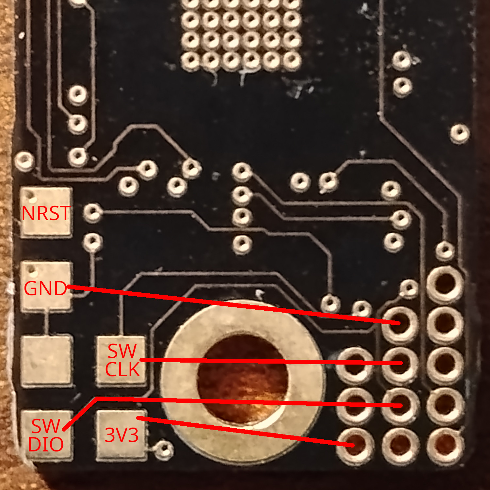
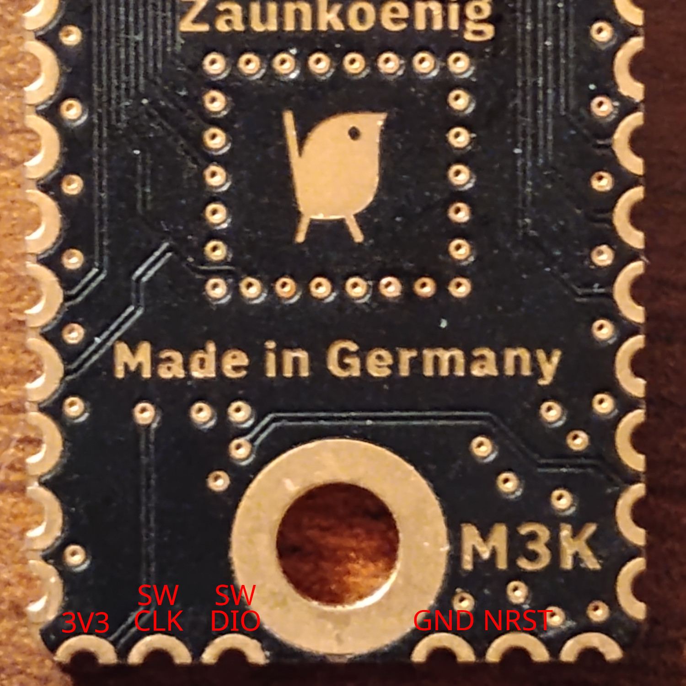

# Firmware
This firmware supports both the M2K and the M3K.

# Third Party
[ARM-software/CMSIS_5](https://github.com/ARM-software/CMSIS_5)<br>
[STMicroelectronics/cmsis-device-f7](https://github.com/STMicroelectronics/cmsis-device-f7)

# Building
You can build using the steps below in a terminal or you can download [STM32CubeIDE](https://www.st.com/en/development-tools/stm32cubeide.html)

## Dependencies
- make
- git
- arm-none-eabi-binutils
- arm-none-eabi-gcc
- arm-none-eabi-newlib

### Install dependencies on Arch
```bash
sudo pacman -S git base-devel arm-none-eabi-binutils arm-none-eabi-gcc arm-none-eabi-newlib
```
### Install dependencies on Ubuntu
```bash
sudo apt update
sudo apt install git build-essential arm-none-eabi-binutils arm-none-eabi-gcc libnewlib-arm-none-eabi
```
## Get the sources

```bash
git clone https://github.com/zaunkoenig-firmware/m3k-firmware
cd m3k-firmware
git submodule update --init --recursive
```
## Building
You can target just m2k or m3k via `make <target>`. By default it will build both.

## Bootloader
```bash
cd bootloader
make
```
## Firmware
```bash
cd mouse
make
```

## Output
`make` will produce a bin and elf file. You will find them in the current directory named after the model. Ex: `m3k.elf` or `m2k_bootlader.bin`

# Flashing
You can flash the firmware many different ways. Flashing to the wrong address could brick the device. Unbricking the device is a bit of a pain so flashing elf files is recommended. The elf files contain the address they are targeting and cannot be flashed to the wrong one.
## Addresses
```
0x08000000 bootloader
0x08008000 firmware
```

## Flashing bin files with dfu-util
Flashing a broken bootloader or the firmware at the bootloader address will brick the device. If you flashed the wrong file and haven't yet restarted the device then you can just flash the correct thing now. If you bricked the device see the unbricking section below.

### Bootloader
```bash
dfu-util -a 0 -s 0x08000000 -D "<bootloader bin file>"
```

### Firmware
```bash
dfu-util -a 0 -s 0x08008000 -D "<firmware bin file>"
```

## Flashing elf files with [STM32CubeProgrammer](https://www.st.com/en/development-tools/stm32cubeprog.html#section-get-software-table)
```bash
~/stm32/cubeprogrammer/bin/./STM32_Programmer_CLI -c port=USB1 -w <elf file> -v
```

# Unbricking your mouse
If you flashed a bad bootloader or accidentally overwrote bootloader with firmware you can unbrick your mouse. You will need a ST-Link or another SWD programmer connected to 3V3, SWDIO, SWCLK and GND pins located on the PCB

### Flashing with St-Link V3 over SWD
```bash
sudo ~/stm32/cubeprogrammer/bin/./STM32_Programmer_CLI -c port=SWD freq=200 -d <bootloader elf file>
```

### M2K Pinout


### M3K Pinout


